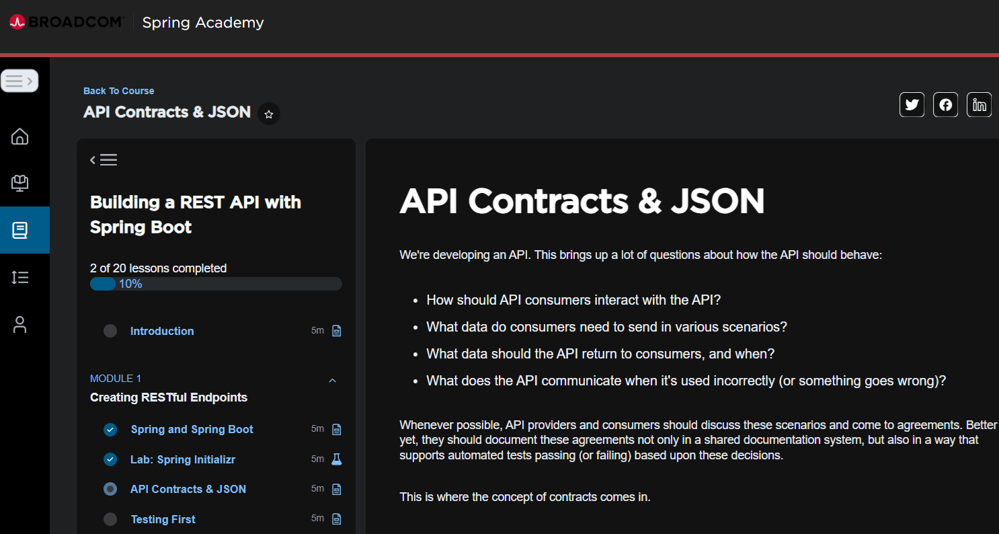

# Progression du module 1  

# 2025-12-27 

Rendu à "API Contracts & JSON  
https://spring.academy/courses/building-a-rest-api-with-spring-boot/lessons/data-contracts  

  

**API Contracts**
Request
  URI: /cashcards/{id}
  HTTP Verb: GET
  Body: None

Response:
  HTTP Status:
    200 OK if the user is authorized and the Cash Card was successfully retrieved
    401 UNAUTHORIZED if the user is unauthenticated or unauthorized
    404 NOT FOUND if the user is authenticated and authorized but the Cash Card cannot be found
  Response Body Type: JSON
  Example Response Body:
    {
      "id": 99,
      "amount": 123.45
    }

**Why API Contracts are important**  
API contracts are important because they communicate the behavior of a REST API.  

**What is JSON**
JSON (Javascript Object Notation) provides a data interchange format that represents the particular information of an object in a format that you can easily read and understand.

# 2025-12-28

Rendu à la leçon "Lab: Testing First"

