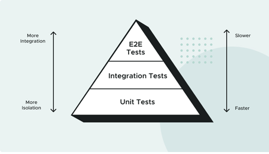

# Testing First  

## What Is Test Driven Development?  
We'll take an alternative approach: we'll write tests before implementing the application code. This is called test driven development (TDD).

Why apply TDD? By asserting expected behavior before implementing the desired functionality,
we’re designing the system based on what we want it to do, rather than what the system already does.

Another benefit of “test-driving” the application code is that the tests guide you to write the minimum code needed to satisfy the implementation.

## The Testing Pyramid
Different tests can be written at different levels of the system. At each level, there is a balance between the speed of execution, the “cost” to maintain the test, and the confidence it brings to system correctness

  
